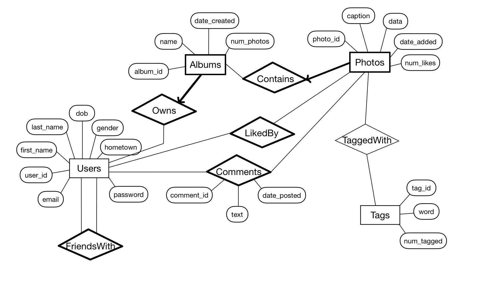

## CS460 Project
# PhotoShare: A simple on-line photo social network system

## Starting the Flask Server
1. Run `pipenv install` to create a virtualenv for this project and install the required dependencies.   
  You may need to install pipenv first (`pip install --user pipenv`).  
2. Run schema.sql script in MySQL Workbench to initialize the photoshare db.
3. Open `app.py` and change `app.config['MYSQL_DATABASE_PASSWORD'] = 'cs460'` to be your MySQL root password.
4. Run `pipenv run python app.py` to start the server on http://localhost:5000 (open browser).

## Application routes
- '/': Landing page
- '/browse': Browse all photos, search photos with specific tag(s)
- '/explore': View top 10 contributing users and most popular tags
- '/album/:aid': View an album and its photos
- '/photo/:pid': View a photo and its caption, tags, likes, and comments; Add comments to photo (liking photo requires login)
- '/tag/:tag': View photos by unique tag word ('/tags/:tags' for multiple tag search in '/browse')
- '/profile/:uid': View a user's profile
- '/register': Create an account
- '/login': Log into an existing account
- '/unauth': Unauthorized page
### Login required:
- '/profile': View my profile
- '/new_album': Create a new album
- '/upload/:aid': Upload a photo to my album

## SQL Schema

- __Users__  
  Each user is identified by a unique user id and has the following attributes: first name, last name, email, date of birth, hometown, gender, and password. A user can have a number of Albums.
- __Friends__  
  Each user can have any number of friends.
- __Albums__  
  Each album is identified by a unique album id and has the following attributes: name, owner
  (user) id, and date of creation. Each album can contain a number of photos.
- __Photos__  
  Each photo is identified by a unique photo id and must belong to an album. Each photo has the
  following attributes: caption and data. The 'data' field should contain the actual binary representation of the uploaded image file. Alternatively, the 'data' field can store the file location of the file that stores the image. Each photo can only be stored in one album and is associated with zero, one, or more tags.
- __Tags__  
  Each tag is described by a single word. Many photos can be tagged with the same tag. For the purpose of this project, we will assume that all tags are lower-cased and contain no spaces. For example, you can have many photos tagged with the tag "Boston" in different albums.
- __Comments__  
  Each comment is identified by a unique comment id and has the following attributes: text (i.e., the actual comment), the comment's owner (a user) and the date the comment was left.  
  user_id defaults to 1000000 for anonymous user comments.

## Use Cases
- __User management__  
__Becoming a registered user.__ Before being able to upload photos a user should register by
providing their first name, last name, email address, date of birth, and a password. If the user
already exists in the database with the same email address an error message should be produced.
The other additional information about each user is optional.  
__Adding and Listing Friends.__ You should allow a user to add a new friend on the friend list.
For simplicity, you do not have to verify the friendship relationship. Also, you must allow a user
to list his/her friends.  
__User activity.__ To motivate users in using the site we'd like to identify the ones who make the
largest contribution and list them on the site. We'll measure the contribution of a user as the
number of photos they have uploaded plus the number of comments they have left for photos
belonging to other users. The top 10 users should be reported.
- __Album and photo management__  
__Photo and album browsing.__ Every visitor to the site, registered or not, should be allowed to
browse photos. In this project we will assume that all photos and albums are made public by
their authors.  
__Photo and album creating.__ After registration, users can start creating albums and uploading
photos. The relevant fields are described above. Users should also be able to delete both albums
and photos. If an non-empty album is deleted its photos should also be purged. Users should
only be allowed to modify and delete albums and photos which they own.  
- __Tag management__  
__Viewing your photos by tag name.__ Tags provide a way to categorize photos and each photo
can have any number of tags. You may think of them as virtual albums. For example, suppose
that a user has two distinct albums each of which contains a photo with the tag 'friends'. The
means should be provided to view the virtual album created if we select all the photos owned by
the user that contain the tag 'friends'. One possible user interface design for this functionality is
to present tags as hyperlinks. When a tag is clicked the photos tagged with it are listed.  
__Viewing the most popular tags.__ A function should be provided that lists the most popular tags,
i.e., the tags that are associated with the most photos. Here you have to consider *all* photos in
the database, not only yours.Again, tags should be clickable so that when a user clicks one of
them all photos tagged with this tag are listed.  
__Photo search.__ The functionality should be provided so that both visitors and registered users
can search through the photos by specifying conjunctive tag queries. For example a visitor could
enter the words "friends boston" in a text field, click the search button and be presented with all
photos that contain both the tag "friends" and the tag "boston".  
- __Comments__  
__Leaving comments.__ Both registered and anonymous users can leave comments. Users cannot
leave comments for their own photos. If registered user leaves a comment then this counts
towards their contribution score as described above.  
__Like functionality.__ We want to add a Like functionality. If a user likes a photo, should be able
to add a like to the photo. Also, we must be able to see how many likes a photo has and the
users that liked this photo. Users cannot like their own photos.